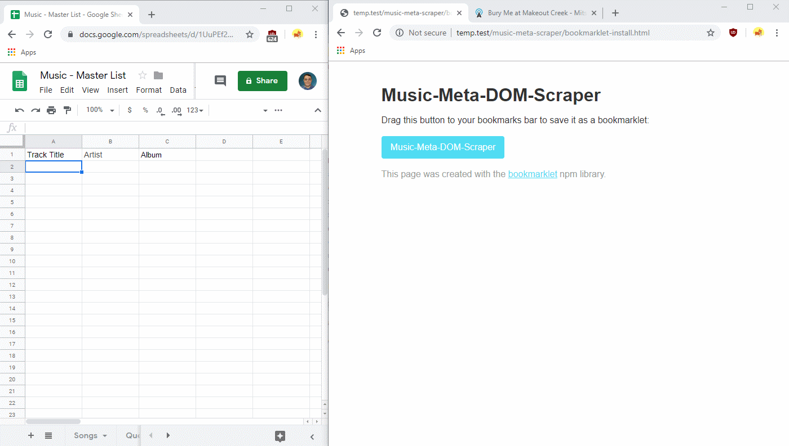

# Music-Meta-Dom-Scraper

## What is this?
Very basic JS Bookmarklet to pull Song / Album Discography information from various websites when you on a webpage that has song metadata, and lets you copy and paste into a spreadsheet or JSON file. 

Useful for those obsessed over cataloging thier music and tracking it by hand (probably very few people).

## Demo

## What it is not
This does not use an API or headless browser; you have to navigate to the source itself and press the bookmarklet. It is not designed around bulk data extraction, other than an album at a time. I do not have plans to turn this into anything more complicated than it is already is.

## Supported sites
Right now, only:
 - AllMusic
 - Bing search results

This repo was mainly created as a way to consolidate the code from two separate bookmarklets I had to use scrape those sources separately.